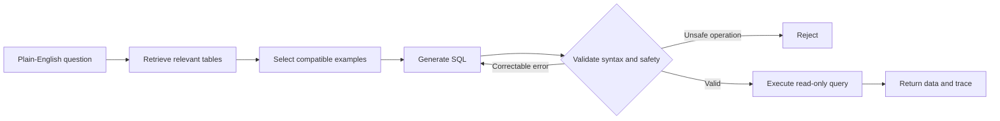

# Text2SQL Agent

> Turn plain-English questions into validated, executable SQL so anyone can explore business data.

Text2SQL Agent is a locally runnable natural-language database interface. It identifies
the relevant tables, asks a language model to generate SQL, validates the query, and
returns real database results through a protected read-only connection.

## Results at a Glance

| Outcome | Measured result |
|---|---:|
| Real-model execution accuracy | **92% (23/25)** |
| Easy / medium question accuracy | **100% / 100%** |
| Queries valid after correction | **96% (24/25)** |
| Automated tests | **33 passing** |
| Evaluation dataset | 7 tables, 1,939 records, 25 questions |

The real-model figures come from one end-to-end `deepseek-flash` evaluation. Each
model-generated query passed through the project's safety checks, ran against SQLite,
and was compared with the reference query result. See the [experiment record](docs/EXPERIMENTS.md)
for the complete configuration, case-level artifacts, and measurement scope.

## What It Does

Traditional database analysis requires users to understand table structures,
relationships, and SQL. This project turns that work into three visible stages:

1. **Retrieve:** identify the tables and relationships relevant to the question.
2. **Generate:** give the model the selected schema and compatible examples.
3. **Validate and execute:** reject unsafe SQL, correct ordinary errors, and execute
   only validated queries through a read-only database connection.

For example, a user can ask:

> Which five customers spent the most money in 2025, excluding refunded orders?

The system finds the customer, order, and line-item data, builds the joins and
aggregation, and returns customer names with revenue. It also records the selected
tables, every SQL attempt, validation results, and latency for inspection.

## Workflow



The project provides a controlled boundary between model output and the database:

- Allows one read-only query and rejects writes, DDL, and multiple statements.
- Uses SQL AST checks for query type, table scope, and join structure.
- Uses SQLite `EXPLAIN` to catch syntax, table, and column errors before execution.
- Applies a read-only connection, function allowlist, time budget, and row limit.
- Retains generation, correction, validation, and execution records for debugging.

## Five-Minute Quick Start

### 1. Requirements

- Python 3.11 or newer
- macOS, Linux, or Windows with PowerShell/WSL
- No API key for the scripted demo

### 2. Install

```bash
git clone <your-repository-url>
cd text2sql-agent

python3 -m venv .venv
source .venv/bin/activate
python -m pip install -e .
```

On Windows PowerShell, activate the environment with:

```powershell
.venv\Scripts\Activate.ps1
```

### 3. Create the Demo Database

```bash
python -m text2sql.cli --init-db
```

The command creates a deterministic e-commerce dataset so runs are reproducible.

### 4. Run the Demo

```bash
python -m text2sql.cli --demo
```

The demo shows a complete cycle: invalid first query, automatic correction, validation,
and safe execution. It uses scripted local responses and does not consume a model API.

### 5. Run the Test Suite

```bash
python -m unittest discover -v
```

## Connect a Real Model

The project supports OpenAI-compatible Chat Completions APIs from local or hosted
providers. Copy the environment template and enter your service details:

```bash
cp .env.example .env
```

```dotenv
TEXT2SQL_DB=data/database.db
TEXT2SQL_LLM=api
TEXT2SQL_BASE_URL=https://api.example.com/v1
TEXT2SQL_MODEL=your-model-name
TEXT2SQL_API_KEY=your-api-key
```

Load the configuration and ask a question:

```bash
set -a
source .env
set +a

python -m text2sql.cli \
  --question "List all customers from Canada. Return customer_id and name."
```

The `.env` file, local databases, and query traces are excluded from Git. API keys are
never written to application traces.

## Run the Experiments

### Offline Pipeline Evaluation

Use reference-query replay to verify retrieval, correction, validation, execution, and
scoring without an API key:

```bash
python -m text2sql.cli --init-db --db data/evaluation.db
python -m text2sql.cli \
  --evaluate --smoke \
  --db data/evaluation.db \
  --output reports/local-oracle.json
```

### Schema-Scope Comparison

Compare full-schema context with Top-K schema retrieval:

```bash
python -m text2sql.cli \
  --ablation --smoke \
  --db data/evaluation.db \
  --output reports/local-ablation.json
```

### Real-Model Evaluation

Load `.env`, then run the benchmark without reference-query replay:

```bash
python -m text2sql.cli \
  --evaluate \
  --db data/evaluation.db \
  --output reports/local-real-model.json
```

The JSON output contains each question's retrieved tables, generated SQL, validation
attempts, execution result, latency, and available token usage. Metric definitions and
completed runs are documented in [docs/EXPERIMENTS.md](docs/EXPERIMENTS.md).

## Experiment Highlights

### DeepSeek Real-Model Run

| Metric | Result |
|---|---:|
| Questions | 25 |
| Valid on first attempt | 23/25 (92%) |
| Valid after correction | 24/25 (96%) |
| Correct execution result | 23/25 (92%) |
| Validation recovery | 1/1 (100%) |
| Mean end-to-end latency | 2.033 seconds |

### Schema-Scope Comparison

| Metric | Full schema | Top-K=4 schema |
|---|---:|---:|
| Mean initial prompt characters | 3,271.0 | 2,396.6 |
| Pipeline execution agreement | 25/25 | 23/25 |

This comparison uses reference-query replay. It measures the effect of schema scope on
context size and pipeline behavior, not model accuracy.

## Technical Implementation

| Area | Implementation |
|---|---|
| Database | SQLite with a deterministic seven-table e-commerce dataset |
| Schema retrieval | Pluggable embedding provider with cosine Top-K ranking |
| Example retrieval | Schema-compatible filtering followed by similarity ranking |
| Model interface | OpenAI-compatible HTTP provider |
| SQL validation | Output normalization, SQLGlot AST checks, SQLite `EXPLAIN` |
| Self-correction | Bounded error feedback and regeneration |
| Safe execution | Read-only connection, authorizer, function allowlist, resource budgets |
| Observability | JSONL traces, latency, prompt size, and token usage |
| Evaluation | Execution-result comparison, schema recall, difficulty breakdown |

The pipeline uses direct Python orchestration rather than LangChain or LlamaIndex,
keeping each workflow stage and security boundary easy to test and inspect.

## Repository Layout

```text
text2sql/
|-- agent/          # Three-stage workflow and correction loop
|-- db/             # Schema, seed data, and protected execution
|-- evaluation/     # Benchmark runner and metrics
|-- generation/     # Prompts, model providers, and SQL generation
|-- retrieval/      # Schema and few-shot retrieval
`-- validation/     # SQL safety and validity checks

tests/              # 33 automated tests
reports/            # Reproducible experiment artifacts
docs/EXPERIMENTS.md # Configurations, metrics, and measured results
```

## Dataset

The demo database models customers, products, categories, suppliers, orders, order
items, and payments. Its 1,939 deterministic records support filtering, ranking,
aggregation, multi-table joins, subqueries, CTEs, refunds, historical prices, and
payment-reconciliation questions.

## Technology

Python 3.11+ · SQLite · NumPy · SQLGlot · OpenAI-compatible API · unittest
