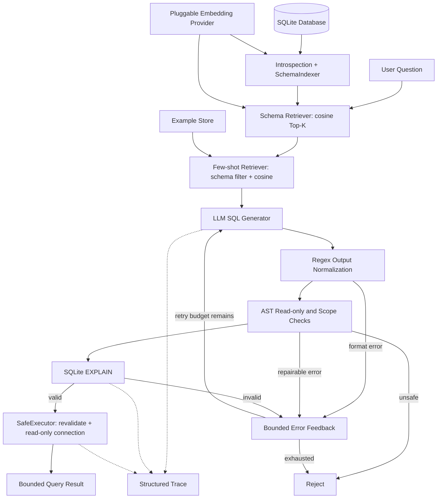
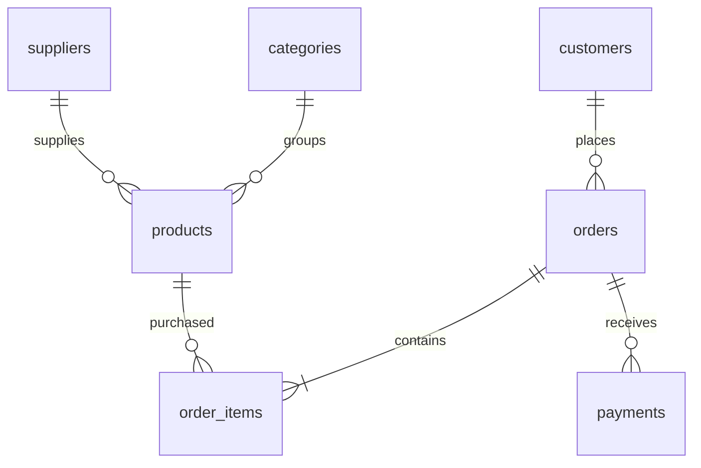

# Text2SQL Agent

An explicit, observable three-stage text-to-SQL pipeline with schema retrieval,
schema-grounded few-shot generation, and database-backed validation/self-correction.
Built in Python without LangChain or LlamaIndex.

**Status:** the offline pipeline, CLI, database, validation, tests, evaluation harness,
and schema ablation run locally. The real-model probe returned HTTP 401; **no real
LLM execution accuracy is claimed**. Default generation is a clearly labeled scripted
demo. The default embedding is a lexical hashing baseline, not a neural semantic model.

## Project Overview

The model proposes SQL; the application owns retrieval, validation, retry decisions,
and database access. Every attempt can be inspected in the returned dataclass or JSONL
trace. Provider protocols make paid APIs unnecessary for unit tests.

See [the Chinese interview guide](docs/INTERVIEW.zh-CN.md) for presentation scripts,
technical questions, and honest resume wording. See [implementation phases](docs/PHASES.md)
for the build and verification record.

## Motivation

Full-schema prompting is a reasonable baseline for seven tables. As schemas grow,
long prompts include irrelevant identifiers, increase context cost, and complicate
name disambiguation. Retrieval controls that context, at the cost of potentially
omitting a necessary table or join bridge. This tradeoff must be measured, not assumed.

Database knowledge matters beyond generating plausible SQL: joining payments directly
to order items can multiply revenue; current catalog prices differ from historical
transaction prices; valid SQL can answer the wrong question. The fixture and evaluation
include these cases.

## Architecture



### Three-Stage Agent Workflow

1. **Retrieve:** introspect table names, typed columns, PKs and FKs. Render each table
   as text, embed it once per index build, normalize vectors, and rank by cosine.
   Select Top-K tables. Include only relationships whose endpoints are selected.
2. **Generate:** filter examples to those whose tables are a subset of the retrieved
   schema, rank their questions with the same embedding interface, and select up to
   three. Construct a dialect-specific SQL-only prompt with schema and business rules.
3. **Validate and correct:** normalize recognized wrappers; reject non-read-only or
   multi-statement ASTs; check table scope and explicit joins; compile with EXPLAIN.
   Repair ordinary validation errors using the original question, same schema,
   previous SQL, and error. Unsafe operations terminate immediately.

After a valid query, `SafeExecutor` revalidates it and runs it on a new protected
connection. Runtime failure is returned separately; runtime errors are not silently
treated as validation success or retried indefinitely.

`max_retries=3` means **one initial generation plus at most three corrections**.
Use `max_retries=2` for three total attempts. Attempts are retained even when a later
provider call fails.

## Installation

Python 3.11+ is required. The recorded local run used Python 3.13.13, SQLite 3.51.2,
NumPy 2.4.6 and sqlglot 30.8.0. The CI workflow configures Python 3.11/3.12/3.13;
remote CI has not been run in this workspace.

```bash
cd text2sql-agent
python3 -m venv .venv
source .venv/bin/activate
python -m pip install -e .
python -m text2sql.cli --init-db
python -m unittest discover -v
python -m text2sql.cli --demo
```

For the recorded core dependency versions, install `-r requirements-lock.txt` before
`pip install -e .`. The local installation was verified with a virtual environment
reusing already installed core dependencies. The optional neural extra is not pinned
or tested in the recorded run.

Database initialization refuses to overwrite an existing file. To create another
fixture use `--init-db --db data/another.db`. Binary databases and local traces are
ignored by Git; the seed script and evaluation JSON are the reproducibility artifacts.

## Example

```bash
python -m text2sql.cli --demo
python -m text2sql.cli --demo --json
python -m text2sql.cli
```

The scripted demo asks:

> Which five customers spent the most money in 2025, excluding refunded orders?

It retrieves `orders`, `payments`, `customers`, and `order_items`, intentionally returns
`SELECT nonexistent FROM customers`, receives an EXPLAIN error, then returns:

```sql
SELECT c.customer_id, c.name,
       ROUND(SUM(i.quantity * i.unit_price), 2) AS revenue
FROM customers AS c
JOIN orders AS o ON c.customer_id = o.customer_id
JOIN order_items AS i ON o.order_id = i.order_id
WHERE o.order_date >= '2025-01-01'
  AND o.order_date < '2026-01-01'
  AND o.status <> 'refunded'
GROUP BY c.customer_id, c.name
ORDER BY revenue DESC, c.customer_id
LIMIT 5
```

Actual seed-42 result:

| customer_id | name | revenue |
|---|---|---:|
| 18 | Customer 018 | 12844.69 |
| 5 | Customer 005 | 11017.68 |
| 6 | Customer 006 | 10278.26 |
| 27 | Customer 027 | 9174.73 |
| 28 | Customer 028 | 7371.41 |

This demonstrates orchestration and recovery, **not model reasoning**. Fake CLI mode
rejects arbitrary questions. Configure a real provider to ask arbitrary questions.

## Configuration

Environment variables are read directly; `.env.example` documents them but `.env`
files are not automatically loaded.

| Variable | Default / purpose |
|---|---|
| `TEXT2SQL_DB` | `data/database.db` |
| `TEXT2SQL_LLM` | `fake`; select `api` for real inference |
| `TEXT2SQL_BASE_URL` | `http://localhost:11434/v1`; include `/v1` if required |
| `TEXT2SQL_MODEL` | Required for real inference |
| `TEXT2SQL_API_KEY` | Falls back to `OPENAI_API_KEY`; never logged |
| `TEXT2SQL_EMBEDDING` | `hashing`, `sentence-transformers`, or `api` |
| `TEXT2SQL_EMBEDDING_MODEL` | `sentence-transformers/all-MiniLM-L6-v2` by default |
| `TEXT2SQL_EMBEDDING_BASE_URL` | Required for API embeddings |
| `TEXT2SQL_EMBEDDING_API_KEY` | Separate embedding credential |
| `TEXT2SQL_TOP_K` | 4 |
| `TEXT2SQL_MAX_RETRIES` | 3 corrections after first attempt |
| `TEXT2SQL_TRACE` | `traces/queries.jsonl` |

For an existing local OpenAI-compatible server, choose a model that server actually
serves, export `TEXT2SQL_LLM=api`, `TEXT2SQL_BASE_URL`, and `TEXT2SQL_MODEL`, then run:

```bash
python -m text2sql.cli -q 'List all customers from Canada. Return customer_id and name.'
python -m text2sql.cli --evaluate --output reports/local-real-model.json
```

The API adapter uses `POST /chat/completions`, temperature 0, a 1500-token output
budget, and a 60-second request timeout. It rejects truncated completions and malformed
responses. Compatibility is not universal: providers that require different message
roles or reasoning-specific parameters need an adapter change. HTTP redirects are
rejected; remote authenticated calls require HTTPS. Provider errors omit response
bodies and credentials. There is no automatic HTTP retry or rate-limit backoff yet.

Optional neural embedding installation:

```bash
python -m pip install -e '.[neural]'
export TEXT2SQL_EMBEDDING=sentence-transformers
export TEXT2SQL_EMBEDDING_MODEL=sentence-transformers/all-MiniLM-L6-v2
```

The first neural run requires a model download. Use a multilingual model for Chinese
semantic retrieval; the default neural model is an English baseline. Hashing includes
Chinese character features and bilingual descriptions but has no learned cross-lingual
understanding. Neural and embedding API adapters exist; the recorded evaluation used
hashing only.

## Database

| Table | Seed-42 rows | Role |
|---|---:|---|
| customers | 60 | country, identity, registration date |
| categories | 5 | catalog categories |
| suppliers | 8 | vendor countries |
| products | 80 | category, supplier, current price, stock |
| orders | 360 | dates spanning 2024-2026 and categorical status |
| order_items | 1,060 | quantity and historical unit price |
| payments | 366 | method, date, split payments and reconciliation discrepancies |



There are customers without orders and products without sales. Revenue is the sum of
historical line values, not current product prices or payment totals. Refunded orders
are excluded only when requested. SQLite's DECIMAL declaration has numeric affinity;
it does **not** provide PostgreSQL NUMERIC-style exact decimal arithmetic. Results are
rounded for this fixture; production financial data should use integer minor units
or an exact-decimal database type.

## Safety and Observability

| Layer | Responsibility |
|---|---|
| Regex normalization | Remove a recognized whole-output wrapper; preserve SQL literals and suffixes |
| Token checks + sqlglot AST | One read-only query, no write/DDL nodes, retrieved tables only, explicit JOINs, no projection `*` |
| SQLite EXPLAIN | Compile and resolve against the database without running the target query |
| Read-only URI + `query_only` | Reject writes independently of prompt behavior |
| Authorizer | Restrict table reads and SQL functions; reject metadata reads, attachment, extension loading and other actions |
| Execution limits | 1000 returned rows plus truncation flag, 2-second progress deadline, 2M VM steps, SQL/value/nesting limits |

Regex is **not a SQL parser**. EXPLAIN is **not a safety policy or a correctness proof**.
In SQLite it exposes compilation/name errors, but permissive GROUP BY, incorrect join
cardinality, wrong date filters, and many runtime errors remain possible. Progress
callbacks are cooperative budgets, not an operating-system memory/CPU sandbox. The
function allowlist is intentionally narrow, and no application-defined functions are
registered on execution connections.

`SafeExecutor` is the public execution boundary. The lower database adapter also
uses protected connections, but callers should use the executor for AST checks.
The seed writer is a separate trusted path. The allowlist controls the model's schema
scope; it is not application user authorization or tenant isolation.

Each completed run records question, trace ID, timestamp, provider names, tables and
scores, examples, raw outputs, validation stages/errors, every correction, final SQL,
execution result, truncation, stage and total latency, prompt characters, and supplied
token usage. Missing token usage is unknown, not estimated zero. Generation timing
excludes index construction; total run latency starts after agent construction.

Traces contain questions and query results: treat them as data, configure retention
before production, and avoid committing real user traces. Demo data is synthetic.

## Evaluation

The benchmark contains 25 authored questions: 8 easy, 8 medium, 9 hard. Gold SQL is
executed on the same read-only fixture as generated SQL. The generation path receives
only the question and retrieved context, never the benchmark answer, except in the
explicit oracle replay mode. Examples are a separate file with distinct questions;
some templates are intentionally similar. This is not a held-out cross-domain benchmark.

```bash
python -m text2sql.cli --init-db --db data/evaluation.db
python -m text2sql.cli --evaluate --smoke --db data/evaluation.db --output reports/oracle-retrieval.json
python -m text2sql.cli --ablation --smoke --db data/evaluation.db --output reports/oracle-ablation.json
```

`--evaluate` without `--smoke` requires a real provider. Do not add `--smoke` to obtain
a flattering model score. Oracle replay injects a deliberately invalid first output
for five cases, then replays reference SQL. It exercises retrieval, validators, retry
limits, executor, tracing, and evaluator, but cannot measure generation skill.

| Metric | Definition |
|---|---|
| Execution accuracy | Fully returned results matching reference / all questions |
| Validation success rate | Final generated queries passing validation / all questions |
| First-pass success rate | First generated queries passing validation / all questions |
| Self-correction recovery rate | Initially invalid queries later passing validation / initially invalid queries |
| Schema recall | Required reference tables retrieved / required reference tables, macro-averaged |

Recovery means validation recovery, not necessarily correct execution. Questions with
no provider response remain in the total denominator but are not initial SQL validation
failures. If no responses are received, the evaluator publishes null metrics and a
provider-unavailable status.

Result comparison preserves duplicate rows, ignores output aliases, requires the same
column count and projection order, uses NULL-aware cell comparison and numeric tolerance
(`rel_tol=1e-9`, `abs_tol=1e-6`), and respects row order on order-sensitive questions.
Unordered comparison uses bipartite matching. Truncated results cannot pass. A single
seed can still allow semantically different SQL to coincide; multiple database instances
are necessary for stronger semantic evidence. Exact SQL match would incorrectly reject
many equivalent joins, aliases, or subquery formulations.

Reports retain per-case results and traces, dependency versions, model and embedding
names, prompt version, retry/Top-K settings, and database/benchmark SHA-256 hashes.

## Benchmark Results

Recorded on 2026-09-07. Sources: [oracle retrieval report](reports/oracle-retrieval.json),
[oracle ablation report](reports/oracle-ablation.json), and
[real-model probe status](reports/real-model-status.json).

**The following numbers are actual oracle replay results, NOT LLM benchmark scores.**

| Measurement | Top-K=4, up to 3 few-shots |
|---|---:|
| Questions | 25 |
| First-pass valid | 18 / 25 (72%) |
| Initially invalid | 7 |
| Recovered | 5 / 7 (71.43%) |
| Final valid | 23 / 25 (92%) |
| Oracle execution agreement | 23 / 25 (92%) |
| Mean schema recall | 96.67% |
| Real-model execution accuracy | Not measured: authentication failed (HTTP 401) |

Failures `h01` and `h04` omit `order_items`. Replaying correct SQL cannot fix missing
context, and the system correctly refuses to execute outside the retrieved schema.
No post-benchmark tuning was applied to hide these failures.

### Schema Ablation

Both arms disable few-shot to isolate schema scope. Same questions, database, hashing
provider, and retry policy; a single sequential run, no statistical confidence claim.

| Measurement | Full schema | Top-K=4 schema |
|---|---:|---:|
| Mean first prompt characters | 3271.0 | 2396.6 |
| Mean total prompt characters, including corrections | 3965.0 | 3559.84 |
| Oracle execution agreement | 25/25 | 23/25 |
| API tokens | Unavailable | Unavailable |

Retrieval reduced initial context here but lost necessary tables. Fake-provider
microsecond latency is not model inference latency, and character counts are not
tokens. This small experiment does not demonstrate a real-model speedup or accuracy
improvement on a large schema.

## Design Decisions

| Choice | Rationale and tradeoff |
|---|---|
| SQLite first, Database Protocol | Zero-service setup and native authorizer/progress controls; PostgreSQL adapter remains future work |
| Native sqlite3 over SQLAlchemy | Exposes the execution controls directly without an ORM; errors are translated to a shared exception |
| NumPy over FAISS | Exact cosine is simple to inspect at table scale; O(Nd) scoring and in-memory storage |
| Hashing by default | No download, deterministic and cheap; lexical baseline with synonym/collision weaknesses |
| sentence-transformers / API adapters | Replace embeddings without changing index/retriever; quality and model-specific prompts need separate evaluation |
| Table-level retrieval | Clear unit of grounding; can miss bridge tables and waste tokens on wide tables |
| Dynamic few-shot with table-subset filter | Avoids incompatible schema leakage; can return fewer than three examples |
| Regex + AST + database compiler | Separates output syntax, policy, and dialect/name validation instead of pretending regex understands SQL |
| Direct Python orchestration | A bounded workflow with visible transitions; not an autonomous planner or a multi-agent system |
| Execution evaluation | Accepts equivalent SQL; still requires diverse data and business-semantic checks |

## Repository Map and Resume Evidence

| Resume claim | Implementation evidence | Verification |
|---|---|---|
| Three-stage agent workflow | [pipeline.py](text2sql/agent/pipeline.py) | [pipeline tests](tests/test_pipeline.py) |
| Schema retrieval via embedding similarity | [embeddings.py](text2sql/retrieval/embeddings.py), [schema_index.py](text2sql/retrieval/schema_index.py) | [retrieval tests](tests/test_retrieval.py) |
| Schema introspection and relationships | [connection.py](text2sql/db/connection.py), [schema.py](text2sql/db/schema.py) | [database tests](tests/test_database.py) |
| Schema-grounded dynamic few-shot prompting | [fewshot.py](text2sql/retrieval/fewshot.py), [prompts.py](text2sql/generation/prompts.py) | [generation tests](tests/test_generation.py) |
| Pluggable LLM generation | [llm.py](text2sql/generation/llm.py), [sql_generator.py](text2sql/generation/sql_generator.py) | [provider tests](tests/test_providers.py); real auth probe failed |
| Regex normalization and AST validation | [safety.py](text2sql/validation/safety.py) | [validator tests](tests/test_validator.py) |
| EXPLAIN dry-run validation | [validator.py](text2sql/validation/validator.py), [connection.py](text2sql/db/connection.py) | actual SQLite EXPLAIN tests |
| Bounded self-correction | [correction.py](text2sql/agent/correction.py) | [correction tests](tests/test_correction.py) |
| Safe execution and tracing | [executor.py](text2sql/db/executor.py), [observability.py](text2sql/observability.py) | execution-budget, CLI and trace tests |
| Execution-based evaluation | [evaluator.py](text2sql/evaluation/evaluator.py), [benchmark.json](text2sql/assets/benchmark.json) | [evaluation tests](tests/test_evaluation.py), recorded oracle reports |

Resume wording supported by the current implementation:

> Built a modular three-stage text-to-SQL pipeline with cosine-based schema retrieval,
> schema-grounded dynamic few-shot prompting, and bounded SQL self-correction; implemented
> regex normalization, AST safety checks, SQLite EXPLAIN validation, read-only execution,
> and a 25-question execution-based evaluation harness.

Do not append a model accuracy, neural-retrieval improvement, production-scale claim,
or PostgreSQL support claim until the corresponding implementation and experiments exist.

## Limitations and Future Work

Real inference remains unverified because the available credential failed authentication.
The offline fake is deliberately scripted. Neural retrieval is an optional adapter,
not the evaluated default. No FastAPI UI, PostgreSQL support, graph expansion, hybrid
retrieval, column retrieval, durable embedding cache, cost pricing, or query summarizer
is implemented.

The fixed schema context cannot recover retrieval misses through SQL correction alone.
The next retrieval experiment should compare a neural baseline, FK bridge expansion,
and an explicit context-expansion retry with a token budget. Schema updates require
`build_index()` again; no automatic schema-version invalidation exists.

Production work would also require user/tenant authorization, audit retention,
process-level resource isolation, read-replica/snapshot handling, connection pooling,
provider backoff, and ambiguity clarification. Those are beyond this local portfolio
system's current boundary.

## Technical References

SQLite [EXPLAIN](https://www.sqlite.org/lang_explain.html) describes compiling without
running the target query. SQLite [authorizer](https://www.sqlite.org/c3ref/set_authorizer.html)
documents per-operation authorization. SQLGlot's [project documentation](https://sqlglot.com/)
describes its parser and AST facilities. Sentence Transformers' [model API](https://www.sbert.net/docs/package_reference/sentence_transformer/model.html)
documents encoding. OpenAI's [Chat Completions reference](https://developers.openai.com/api/reference/resources/chat/subresources/completions/methods/create)
documents the API protocol used for the attempted real-model probe.
